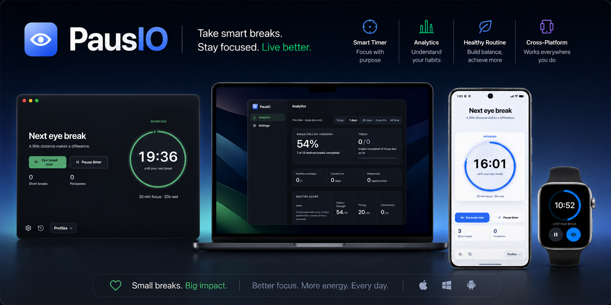
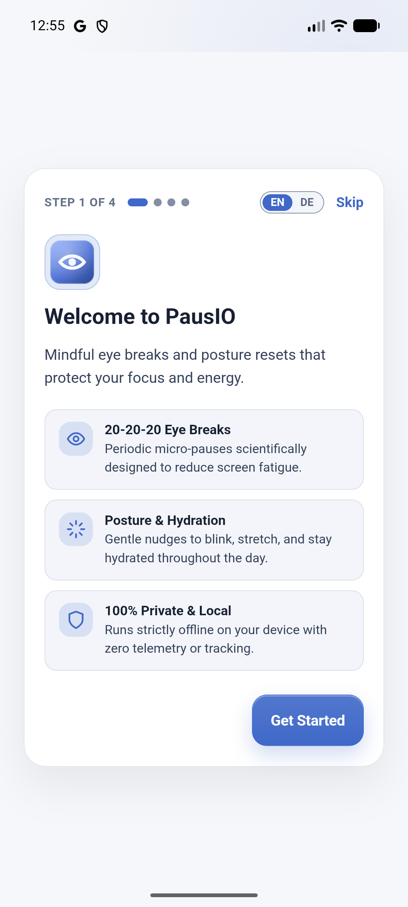
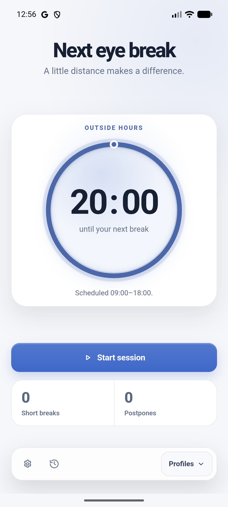
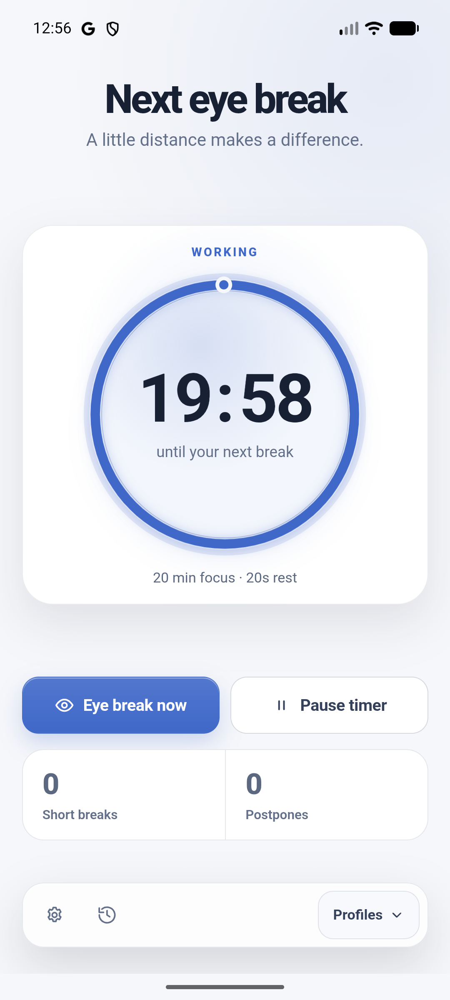
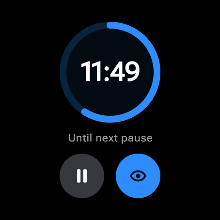

<div align="center">



# PausIO

**A calm, private, local-first 20-20-20 eye-care companion for desktop, mobile & smartwatch.**

[](LICENSE)
[](crates/pausio-protocol)
[](https://github.com/adechristanto/PausIO/actions/workflows/ci.yml)
[](https://github.com/adechristanto/PausIO/releases)

<br />

</div>

---

PausIO helps you protect your eyesight and posture by following the **20-20-20 rule**: every **20 minutes**, take a **20-second** break and look at something **20 feet** (6 meters) away.

Unlike aggressive break timers that interrupt you during presentations or video calls, PausIO is built with **smart context awareness**, **calm nudges**, and **zero telemetry**. Everything runs 100% locally on your devices.

---

## ✨ Features

- **System Tray Operation**: Sits quietly in the background without cluttering your dock or taskbar; quick access from the tray icon.
- **Adaptive Break Delivery**: Choose between four reminder modes:
  - _Notify only_: Gentle system notification banner.
  - _Ask first_: Toast prompt with options to start now, postpone, or take a timed break.
  - _Direct overlay_: Dim the screen with an elegant countdown and eye exercise cues.
  - _Firm mode_: Strict focus enforcement with emergency override safeguards.
- **Smart Context Deferrals**: Automatically delays breaks during continuous typing bursts everywhere, plus fullscreen detection on macOS/Windows and Focus Assist detection on Windows. You can also set a manual context (meeting, screen share, etc.) from Settings on any platform.
- **Session & Idle Detection**: Pauses automatically when you step away from your computer; natural absences count towards your rest cycle.
- **Every Device Works On Its Own**: Desktop, phone, and watch each run the full timer independently — no pairing, no companion app, no network. The phone schedules its own break reminders in advance, so they arrive even while the app is closed.
- **Optional Wearable Companion**: Connect an Apple Watch (watchOS) or Wear OS companion from Settings for a private haptic wrist buzz, and choose whether breaks announce on your phone, your watch, or both. Off by default.
- **Local-First & Private**: No accounts, no cloud sync, no tracking, zero outbound network telemetry.
- **English & German** localization.

---

## 📱 Screenshots

The mobile and wearable companions are engineering previews; the screens below
are captured from those builds. Desktop screenshots are not included yet.

<div align="center">

|                                              Onboarding                                              |                                             Dashboard                                              |                                                  Active timer                                                  |
| :--------------------------------------------------------------------------------------------------: | :------------------------------------------------------------------------------------------------: | :------------------------------------------------------------------------------------------------------------: |
|  |  |  |



_Wear OS companion — an optional, private haptic nudge on the wrist._

</div>

---

## 🚧 Release Status

PausIO is currently in **pre-release development**. There are no official production binaries yet. Build from source using the instructions below if you want to evaluate the project.

The release-candidate workflow may create draft releases with unsigned engineering artifacts. Those artifacts are intended for maintainer validation only and must not be treated as production distributions. Public binaries will be announced after platform signing, notarization, installation, and physical-device checks are complete.

---

## 🖥️ Platform Support

Every platform below runs standalone. The wearable column describes what a
device can _optionally_ connect to, never what it requires.

| Platform        | Standalone | Current maturity              | Platform integration                                   |
| :-------------- | :--------- | :---------------------------- | :----------------------------------------------------- |
| **macOS**       | Yes        | Local engineering validated   | System tray, native sound cues, aggregate idle         |
| **Windows**     | Yes        | Build validated; runtime open | System tray, SmartScreen / Focus Assist detection      |
| **Linux**       | Yes        | Build validated; runtime open | See [Wayland Roadmap](docs/LINUX_WAYLAND_PLAN.md)      |
| **Android**     | Yes        | Engineering preview           | Local alarms; optional Wear OS companion               |
| **iOS**         | Yes        | Engineering preview           | Local notifications; optional Apple Watch companion    |
| **Apple Watch** | Yes        | Simulator-tested preview      | Own offline schedule; syncs from iPhone when connected |
| **Wear OS**     | Yes        | Emulator-tested preview       | Own offline alarms; syncs from Android when connected  |

Desktop builds contain no wearable code at all — the bridge is compiled only
into the iOS and Android hosts.

---

## 🛠️ Development & Building from Source

### Prerequisites

| Tool        | Required Version                            | Purpose                             |
| :---------- | :------------------------------------------ | :---------------------------------- |
| **Rust**    | `1.93.0` (pinned via `rust-toolchain.toml`) | Core timing engine & Tauri backend  |
| **Node.js** | `22.x` (or see `.nvmrc`)                    | Frontend tooling                    |
| **pnpm**    | `10.33.0`                                   | Monorepo package manager            |
| **Java**    | `17`                                        | Android builds (optional)           |
| **Xcode**   | `16+`                                       | iOS / Apple Watch builds (optional) |

On Linux, a desktop build additionally needs the WebKitGTK and tray system libraries before `cargo`/`pnpm tauri` can link the app:

```bash
sudo apt-get update
sudo apt-get install -y libgtk-3-dev libwebkit2gtk-4.1-dev libayatana-appindicator3-dev librsvg2-dev
```

(Package names are for Debian/Ubuntu; use your distribution's equivalents on Fedora, Arch, etc.)

### Quick Start

```bash
# 1. Clone the repository
git clone https://github.com/adechristanto/PausIO.git
cd PausIO

# 2. Install frontend dependencies
pnpm install --frozen-lockfile

# 3. Launch desktop development environment
pnpm tauri dev
```

### Running Tests & Verification

```bash
# Frontend checks & unit tests
pnpm check && pnpm test

# Rust engine & desktop checks
cargo fmt --check
cargo clippy --workspace --all-targets --all-features -- -D warnings
cargo test --workspace --all-features
cargo llvm-cov -p pausio-core --lib --fail-under-lines 90 --summary-only

# Apple Watch tests (macOS only)
(cd watch/apple-watch && swift test)

# Desktop E2E tests
pnpm test:e2e:desktop
```

---

## 🔒 Privacy & Threat Model

PausIO is built with an uncompromising commitment to privacy:

- **No telemetry or analytics**: No third-party trackers, crash log aggregators, or behavioral telemetry.
- **Local data storage**: Preferences, schedules, and history stay in local JSON storage. PausIO does not currently add application-level encryption, so at-rest protection depends on your operating system and disk-encryption settings.
- **Zero surveillance**: PausIO **never** accesses your webcam, microphone, active window titles, keystrokes, or screen contents. Context deferrals rely solely on aggregate OS idle/lock hints.

See [`SECURITY.md`](SECURITY.md) for vulnerability disclosure procedures.

---

## 📖 Architecture & Documentation

- [**Architecture Overview**](docs/architecture.md) — Internal crate breakdown, IPC events, and state machine design.
- [**Roadmap**](ROADMAP.md) — Upcoming features, Wayland parity, and distribution milestones.
- [**Linux / Wayland Spec**](docs/LINUX_WAYLAND_PLAN.md) — Implementation details for Linux D-Bus and compositor protocols.
- [**Release & Signing Architecture**](docs/RELEASE_PIPELINE.md) — Code-signing specifications for production distribution.

---

## 🤝 Contributing

Contributions are welcome! Please read [**CONTRIBUTING.md**](CONTRIBUTING.md) for development guidelines, branch conventions, and PR expectations.

All contributors are expected to uphold our [**Code of Conduct**](CODE_OF_CONDUCT.md).

---

## 📄 License

- Application Shell and Timer Engine: **[GPL-3.0-only](LICENSE)**
- Shared Protocol Crate (`crates/pausio-protocol`): **[MIT](crates/pausio-protocol/LICENSE-MIT) OR [Apache-2.0](crates/pausio-protocol/LICENSE-APACHE)** (allowing seamless integration in watch companions without GPL inheritance).

---

<div align="center">
Made with care for your health and focus.
</div>
